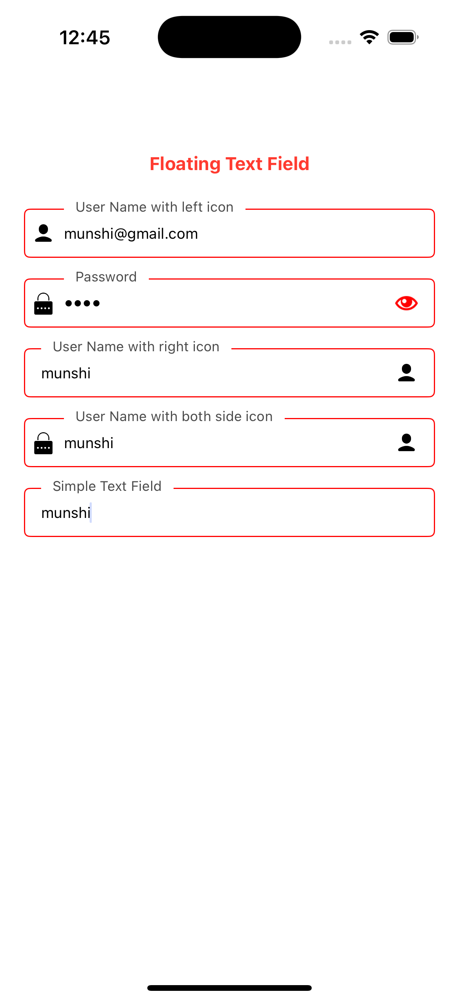

# FloatingTextField - iOS Custom UI Component

A customizable `UITextField`-based component that provides a **floating label**, **icon support**, and **optional password field behavior**. Built with `UIKit` for Swift-based iOS projects.




## ✨ Features

- Floating placeholder label
- Customizable left and right icons
- Password toggle with eye icon
- Date picker support
- Full control over `UITextField` properties
- Delegate forwarding for text input

## 🧹 Installation

Add the `FloatingTextField.swift` file to your Xcode project.

## 🛠 Usage

### 1. Programmatic Usage

```swift
let floatingTextField = FloatingTextField()
floatingTextField.placeholder = "Email"
floatingTextField.leftIcon = UIImage(systemName: "envelope")
floatingTextField.textColor = .black
floatingTextField.borderColor = .lightGray
floatingTextField.titleColor = .systemBlue
floatingTextField.delegate = self
```

### 2. Password Field

```swift
floatingTextField.isPasswordField = true
floatingTextField.placeholder = "Password"
```

### 3. Add to View & Set Constraints

```swift
view.addSubview(floatingTextField)
floatingTextField.translatesAutoresizingMaskIntoConstraints = false
NSLayoutConstraint.activate([
    floatingTextField.topAnchor.constraint(equalTo: view.safeAreaLayoutGuide.topAnchor, constant: 50),
    floatingTextField.leadingAnchor.constraint(equalTo: view.leadingAnchor, constant: 20),
    floatingTextField.trailingAnchor.constraint(equalTo: view.trailingAnchor, constant: -20),
    floatingTextField.heightAnchor.constraint(equalToConstant: 50)
])
```

### 4. Date Picker as Input View

```swift
floatingTextField.setInputViewDatePicker(
    target: self,
    selector: #selector(handleDateSelection),
    startDate: Date(),
    endDate: nil
)

@objc func handleDateSelection() {
    if let datePicker = floatingTextField.textField.inputView as? UIDatePicker {
        let formatter = DateFormatter()
        formatter.dateStyle = .medium
        floatingTextField.text = formatter.string(from: datePicker.date)
    }
}
```

## 🧹 Customizable Properties

| Property | Description |
|---------|-------------|
| `text` | Access or set the input text |
| `textColor` | Text color of the input field |
| `font` | Font of the text |
| `textAlignment` | Text alignment |
| `keyboardType` | Keyboard type |
| `isSecureTextEntry` | Secure entry for passwords |
| `autocapitalizationType` | Capitalization behavior |
| `autocorrectionType` | Autocorrection setting |
| `returnKeyType` | Return key type |
| `delegate` | TextField delegate forwarding |
| `leftIcon`, `rightIcon` | Support for icons |
| `borderColor` | Color of the border |
| `titleColor` | Color of the floating label when active |
| `placeholderColor` | Color of the placeholder when inactive |

## 📌 Notes

- The placeholder automatically animates above the text field when text is entered.
- The password eye icon switches visibility with a tap.
- Date picker integration includes toolbar with Cancel and Done.

## 📂 Screenshots

| Empty Mode | Fill Mode |
|------------|-----------|
|  |  |

---

## 📄 License

This project is open-source and available for use under the MIT License.

---

Created with ❤️ by [Shamim Munshi](https://github.com/munshicomputer)

